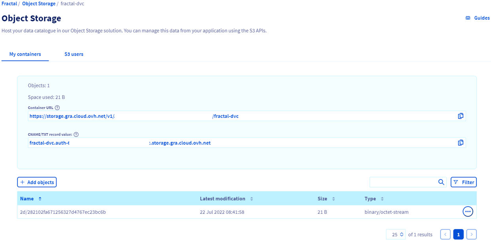

# DVC

### Index
- [Introduction](#introduction)
- [Documentation](#documentation)
- [Pre-requisites](#pre-requisites)
- [Install & Configure DVC](#install-and-configure-dvc)
- [Using DVC](#using-dvc)

### Introduction
[DVC](https://dvc.org/) (Data Version Control) is a framework created to manage the version control of big files, which includes AI models.
DVC is built to make ML models shareable and reproducible. It is designed to handle large files, data sets, 
machine learning models, and metrics as well as code.

In FRACTAL Cloud Platform DVC will be used for the storage of machine learning models and their code.  

### Documentation
- [Using OVH Object Storage S3 compatible API](https://docs.ovh.com/es/storage/s3/getting-started-with-s3/#installation)
- [Installing DVC](https://dvc.org/doc/install)
- [Getting Started with DVC](https://dvc.org/doc/start)
- [DVC User Guid](https://dvc.org/doc/user-guide)


### Pre-requisites
- [Python](https://www.python.org/downloads/): The version used for the FRACTAL Cloud Platform has been Python 3.8.
- [PIP](https://pypi.org/project/pip/): The version used for the FRACTAL Cloud Platform has been pip 22.1 (python 3.8).
- [An OVH User with the ObjectStore operator role](https://docs.ovh.com/gb/en/public-cloud/creation-and-deletion-of-openstack-user/): Create OpenStack users in OVH.

### Install and Configure DVC
DVC (Data Version Control) can be [installed in several ways](https://dvc.org/doc/install) (e.g., with pip, with snap, from common repositories for 
Linux distributions, etc.). However, the most common way to install DVC is as a python package through pip. 

#### Install DVC
DVC can be used as a Python library with a package manager like pip or conda, or as a Python project 
requirement if needed. For [installing DVC with pip](https://dvc.org/doc/install/linux#install-with-pip), the following command has been used.

Depending on the type of the remote storage planed to use, optional dependencies might be installed. In FRACTAL Cloud 
Platform, the OVH Object Storage will be used, which is compatible with the AWS S3 API. Thus, DVC will be
installed with the [s3] dependency.

```bash
pip install "dvc[s3]"
```

#### Getting Access to OVH Object Storage
For using  the OVH Object Storage as a remote storage in DVC, first a pair of access keys 
(access key and access secret) must be obtained to grant DVC access to the OVH Object Storage.

The first step is to download the OpenStack's RC file as shown in the [OVH guide for using the AWS CLI with 
OVH Object Storage as AWS S3](https://docs.ovh.com/es/storage/s3/getting-started-with-s3/#configuration).

Onnce the openrc.sh script has been downloaded, the OpenStack environment variables must be set with the
following command:

```bash
source openrc.sh
```

Next some required packages for using the  python-openstack client and the aws-cli must be installed:

```bash
pip install python-openstackclient awscli awscli-plugin-endpoint
```

Then with the python-openstack client a new pair of ec2 credentials must be created:

```bash
openstack ec2 credentials create
```

This will generate an output similar to the following:

```bash
+------------+--------------------------------------------------------------------------------------------------------------------------------------------+
| Field      | Value                                                                                                                                      |
+------------+--------------------------------------------------------------------------------------------------------------------------------------------+
| access     | 86cfae29192b4cedb49bbc0f067a9df8                                                                                                           |
| links      | {'self': 'https://auth.cloud.ovh.net:35357/v3/users/a1a8da433b04476593ce9656caf85d66/credentials/OS-EC2/86cfae29192b4cedb49bbc0f067a9df8'} |
| project_id | 702de32b692c4842b0bb751dc5085daf                                                                                                           |
| secret     | 3b3e625d867d4ddb9e748426daf5aa6a                                                                                                           |
| trust_id   | None                                                                                                                                       |
| user_id    | a1a8da433b04476593ce9656caf85d66                                                                                                           |
+------------+--------------------------------------------------------------------------------------------------------------------------------------------+
```

The next step is to configure the aws credentials and configuration file. 

The content of the ~/.aws/credentials file should be similar to the following:

```bash
user@host:~$ cat ~/.aws/credentials

[default]
aws_access_key_id = 86cfae29192b4cedb49bbc0f067a9df8
aws_secret_access_key = 3b3e625d867d4ddb9e748426daf5aa6a
```

The content of the ~/.aws/config file should be similar to the following:

```bash
user@host:~$ cat ~/.aws/config

# Delete the next two lines if you don't installed `awscli-plugin-endpoint`
[plugins]
endpoint = awscli_plugin_endpoint

[profile default]
region = gra
s3 =
  endpoint_url = https://s3.gra.perf.cloud.ovh.net
  signature_version = s3v4
s3api =
  endpoint_url = https://s3.gra.perf.cloud.ovh.net
```

#### Create and Configure an OVH Object Storage Bucket to be used with DVC
Once the credentials for have been configured, a new OVH Object Storage bucket can be created with the following command:

**_Note: This step has to be done only once. Once the S3 bucket has been created this step must be skiped._**

```bash
aws s3 mb s3://fractal-dvc
```

Once the access to the OVH Object Storage has been configured and the bucket  has been created it can be used
as a usual AWS S3 bucket (see for example the following command to list the available buckets). 

```bash
aws s3 ls
```

### Using DVC
Next an example of how to initialize a DVC repository with remote storage on OVH Objects Storage is shown.

```bash
# Initialize repository
# If DVC will not be used inside a Git repository, add the flag --no-scm to 'dvc init' command
dvc init --no-scm
# Add OVH Object Storage bucket as remote storage
dvc remote add -d ovh s3://fractal-dvc -f
# Modify the remote storage endpoint url
dvc remote modify ovh endpointurl https://s3.gra.cloud.ovh.net
# Add a dummy test file to test that the set-up works properly.
dvc add test.txt
# Commit changes
dvc commit
# Push changes
dvc push
```

This will generate some objects in the OVH Object Storage, for tracking the files in DVC (see figure below).



*DVC created objects in OVH Object Storage.*

For further usage instructions please refer to the [official documentation of DVC](https://dvc.org/doc/start) and [user guides](https://dvc.org/doc/user-guide).


